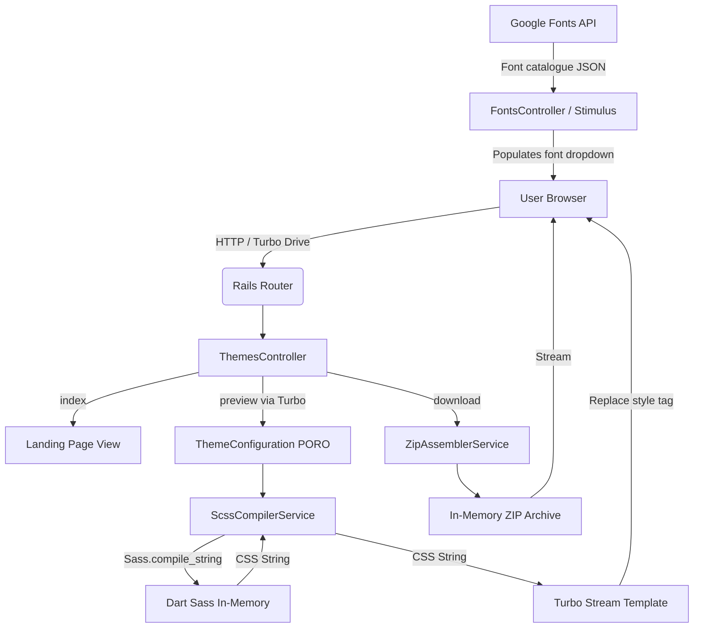
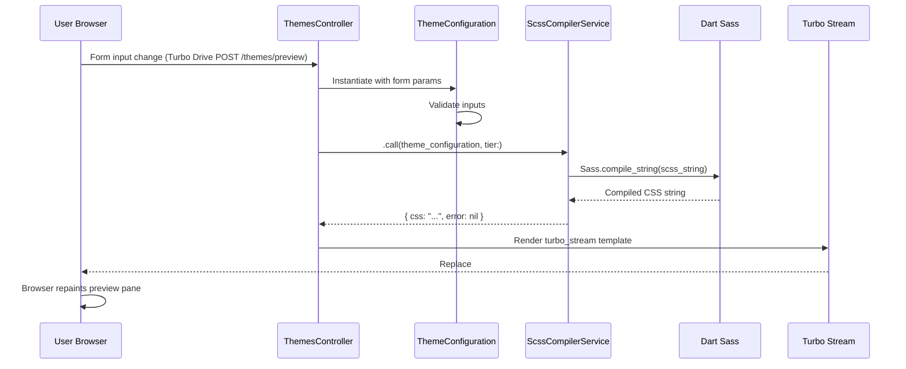
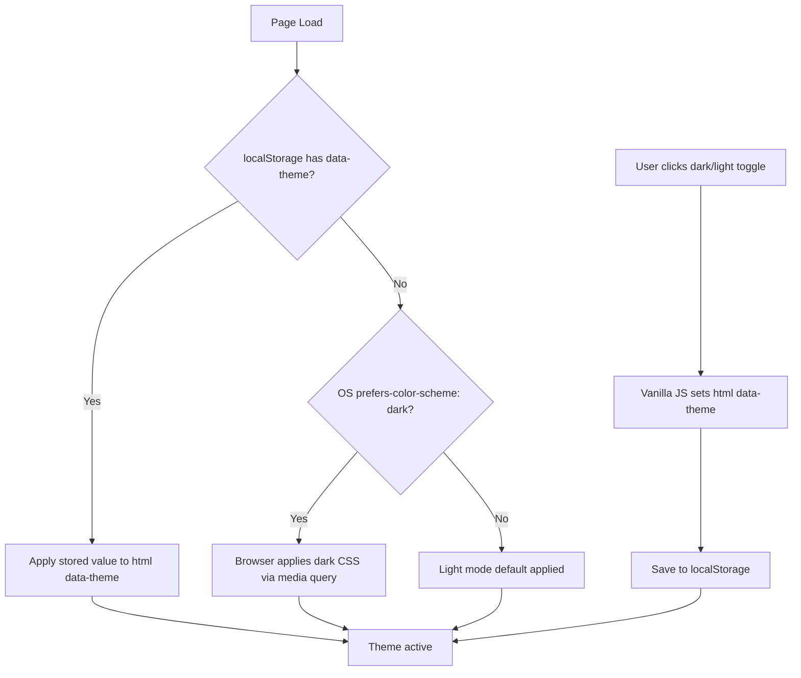

# Product Requirements Document (PRD)

> **Project:** nanoCSS — CSS Theme & Component Generator
> **Version:** 0.3
> **Author:** [Your Name]
> **Date:** 2026-04-11
> **Status:** 🟡 Draft

---

## 1. Executive Summary

Independent developers building web projects are caught in a no-man's land: heavyweight utility frameworks like Tailwind impose an opinionated HTML class-soup, while bare-bones resets offer nothing at all. **nanoCSS** solves this by giving the solo developer a browser-based generator that produces a genuinely lightweight, bespoke CSS framework — styled exactly to their brand, containing only the components they actually need, and downloaded as a ready-to-use file in seconds.

The companion web app lets a user pick a preset theme or dial in their own colours, fonts, and spacing, watch their choices render live against real HTML primitives, then download their tailored framework as standard CSS, minified CSS, or a full modular SCSS archive. Because the output is pure, dependency-free CSS and Vanilla JS, it drops straight into any project — static site, Rails app, or React build — with no lock-in and no build-tool ceremony.

The product name carries a promise: the user controls the **nano** footprint by selecting only the layers they need, from bare semantic HTML styling right up to the full suite of interactive components.

---

## 2. Assumptions & Dependencies

### Assumptions

- [ ] Target users are developers comfortable with HTML/CSS; no GUI drag-and-drop builder is required for MVP.
- [ ] Users will access the app via a modern browser (Chrome 110+, Firefox 110+, Safari 16+, Edge 110+).
- [ ] No user accounts, authentication, or persistent server-side storage are required for MVP; the app is fully stateless.
- [ ] Browser `localStorage` is available for persisting the user's dark-mode preference on the client side.
- [ ] Google Fonts API is publicly accessible without an API key for listing and embedding fonts (standard `@import` URL pattern).
- [ ] Dart Sass can be executed in-process (no shell subprocess) within the Rails/Passenger environment — specifically, the `sass-embedded` or `sass` gem must be compatible with the VPS Ruby version and glibc.
- [ ] The downloaded `.zip` file is assembled and streamed entirely in memory — no temporary files written to disk.
- [ ] An 8px / 0.5rem baseline spacing grid and the Major Third (1.25) typographic scale are acceptable defaults and are aesthetically defensible choices for the preset themes.
- [ ] "Indie dev" persona: single developer, solo project, comfortable copy-pasting HTML snippets from documentation.

### External Dependencies

| Dependency | Type | Owner / Provider | Notes |
|---|---|---|---|
| Ruby on Rails 7+ | App framework | OSS / Shopify | Stateless config; no ActiveRecord |
| Hotwire (Turbo + Stimulus) | Frontend reactivity | OSS / 37signals | Turbo Streams for live preview; Stimulus for any minimal app-UI JS |
| Dart Sass (`sass` gem) | SCSS compiler | Google / OSS | In-memory compilation via `Sass.compile_string()` |
| Google Fonts API | Font catalogue | Google | Dynamic `@import` URL injection; no API key required for web embeds |
| Rubyzip (or equivalent) | ZIP assembly | OSS | Streaming `.zip` archive to browser on download |

---

## 3. Out of Scope (MVP)

> These items are explicitly deferred. Stating them here is the primary defence against scope creep.

- [ ] User accounts, authentication, or server-side saved theme persistence.
- [ ] Database or any server-side persistence of theme configurations.
- [ ] A native mobile app (web only).
- [ ] Social / OAuth login.
- [ ] Multi-language / i18n support (English only, v1).
- [ ] A visual drag-and-drop page builder.
- [ ] WYSIWYG component editor (copy-paste HTML snippets only).
- [ ] A CDN-hosted distribution of nanoCSS (download only for MVP).
- [ ] WordPress, Shopify, or other CMS plugin integrations.
- [ ] A CLI tool / npm package (post-MVP roadmap item).
- [ ] Paid plans, SaaS billing, or a freemium gate.
- [ ] Component-level theming overrides (global design tokens only for MVP).

---

## 4. Functional Requirements

### FR-001: Preset Theme Selection
**Description:** The Landing Page must offer at minimum three ready-made preset themes (e.g., Corporate, Playful, Minimalist). Clicking a preset immediately applies it to the live preview — no form submission required. Each preset encodes a complete set of design tokens (colours, fonts, spacing multipliers).
**Priority:** 🟥 Must Have

### FR-002: Custom Theme Configuration
**Description:** The Configuration Page must expose a sidebar form allowing the user to override any design token. At minimum: Primary, Secondary, and Tertiary brand colours (hex input + colour picker); Header, Subtitle, and Body font selections (Google Fonts); baseline font size; baseline spacing unit; border-radius variants (sm, md, lg, pill); and the CSS/SCSS variable namespace prefix (default: `nanocss`).
**Priority:** 🟥 Must Have

### FR-003: Basic / Advanced Configuration Modes
**Description:** The sidebar form must operate in two modes. **Basic Mode** exposes only the anchor variables (brand colours, base font size, base spacing unit). **Advanced Mode** unlocks individual token overrides, allowing the user to break the ratio system and set, for example, `$nanocss-space-4` to an arbitrary value independently. Switching between modes must not reset previously entered values. Only explicitly clicking a dedicated **Reset** button will restore all inputs to their defaults.
**Priority:** 🟥 Must Have

### FR-004: Real-Time Live Preview
**Description:** Any change to a configuration input must trigger an immediate, seamless preview update — no full page reload. The update must replace only the `<style>` tag in the preview pane DOM. The perceived latency from input change to visual update must be under 200ms on a standard broadband connection. The preview must render against real, representative HTML elements: headings, body text, buttons (primary/secondary/danger), form inputs, a card, and a badge.
**Priority:** 🟥 Must Have

### FR-005: Selective Component Inclusion
**Description:** The user must be able to choose which layers of the framework to include in their download. The selector must offer at minimum three distinct tiers:
1. **Nano** — CSS reset + semantic HTML element styling only (no class-based components).
2. **Standard** — Nano + helper utility classes (spacing, flex/grid, typography, visibility).
3. **Full** — Standard + the complete interactive component library.

Individual component-level toggling (e.g., include Carousel but exclude Modal) is a **Should Have** for Sprint 1 and a **Must Have** by v1.0.
**Priority (tier selector):** 🟥 Must Have | **Priority (per-component toggle):** 🟧 Should Have

### FR-006: Colour Harmony Generator
**Description:** When the user selects a Primary brand colour, the app must offer an automatic palette suggestion using at least the following harmony algorithms: Complementary, Analogous, Triadic, Monochromatic, and Split-Complementary. Suggested palettes must be presented as clickable swatches that populate the Secondary and Tertiary colour inputs. The user may accept, modify, or ignore the suggestion.
**Priority:** 🟧 Should Have

### FR-007: Semantic Colour Tinting
**Description:** The SCSS compiler must apply `color.mix()` to blend a subtle proportion of the user's Primary colour into each of the four semantic colours (Success, Info, Warning, Danger), preserving their conventional hue identity while achieving visual cohesion with the brand palette. This must happen automatically during compilation; no additional user input is required.
**Priority:** 🟧 Should Have

### FR-008: Google Fonts Integration
**Description:** The font selector inputs must dynamically fetch the available font list from the Google Fonts API and present them in a searchable/filterable dropdown. Selecting a font must inject the correct `@import url(...)` directive into the generated SCSS output. Three distinct font slots must be available: Headers, Subtitles, Body Text.
**Priority:** 🟧 Should Have

### FR-009: Dark Mode (Three-Tier System)
**Description:** The generated framework CSS must support dark mode via a strict three-tier priority cascade:
1. OS-level: `@media (prefers-color-scheme: dark)` as the baseline default.
2. User override: `<html data-theme="dark|light">` attribute toggled by a Vanilla JS snippet (included in the download).
3. Persistence: User override stored in browser `localStorage` and reapplied on page load.

The nanoCSS generator app itself must also implement this same three-tier system for its own UI.
**Priority:** 🟥 Must Have

### FR-010: Download / Export Engine
**Description:** A "Download" button (persistent, accessible from the Configuration and Component Catalogue pages) must compile the current configuration in-memory using Dart Sass and stream a `.zip` archive to the browser. The archive must contain:
- `nanocss.css` — full human-readable compiled CSS.
- `nanocss.min.css` — minified CSS.
- `scss/` — the modular raw SCSS source files (variables, mixins, reset, utilities, and one file per component).

The archive name and the CSS variable prefix must reflect any custom namespace the user has configured (e.g., `mytheme.css` if prefix is `mytheme`).
**Priority:** 🟥 Must Have

### FR-011: Component Catalogue
**Description:** A dedicated page must display every framework component with: (a) a live rendered example, (b) copyable raw HTML snippet, and (c) where applicable, a copyable Vanilla JS snippet. A sidebar navigation must allow jumping directly to any component. Components must render using the currently active theme configuration. Every top-level HTML element of a component must carry a namespaced class reflecting the active prefix (e.g. `.nanocss-card`, `.nanocss-modal`) to ensure unambiguous style targeting and zero collision with host-page CSS.
**Priority:** 🟥 Must Have

### FR-012: Variable Namespacing
**Description:** The user must be able to set a custom string prefix for all generated SCSS variables (`$<prefix>-*`) and CSS custom properties (`--<prefix>-*`). The default prefix is `nanocss`. The prefix input must be validated: lowercase alphanumeric and hyphens only, no spaces, no leading/trailing hyphens. This prevents naming collisions when the generated CSS is loaded alongside other stylesheets.
**Priority:** 🟥 Must Have

### FR-013: CSS Reset (Bespoke)
**Description:** The framework must include a bespoke, lightweight modern CSS reset baked directly into the output — not a third-party file (no Normalize.css, no Eric Meyer reset). The reset must be scoped to the user's chosen prefix where applicable and must not conflict with host-page styles.
**Priority:** 🟥 Must Have

### FR-014: Shareable Theme URLs
**Description:** The Configuration Page must provide a "Copy Share Link" button that encodes the entire current theme configuration (all design token values, selected tier, namespace prefix) as a base64 URL parameter appended to the configuration page URL (e.g., `/configure?theme=eyJwcmltYXJ5IjoiI...`). When a user visits such a URL, the configuration form must be pre-populated from the decoded parameter — no database or user account required. The encoded payload must be URL-safe base64 (standard `Base64.urlsafe_encode64` in Ruby). A malformed or tampered parameter must fail gracefully, loading the default configuration with an inline notice.
**Priority:** 🟥 Must Have (Sprint 1)

---

## 5. User Flows

### Flow 1: First-Time User — Preset to Download

1. User arrives at the **Landing Page**; sees the value proposition headline and three preset theme cards (Corporate, Playful, Minimalist).
2. User clicks **"Playful"** — the preview pane on the landing page instantly applies the Playful theme tokens.
3. User clicks **"Customise"** — navigated to the **Configuration Page** with the Playful preset pre-loaded.
4. User changes the Primary colour via the hex input; the colour harmony generator suggests Secondary and Tertiary swatches.
5. User accepts a suggested palette; the live preview pane updates seamlessly via Turbo Stream.
6. User switches to **Advanced Mode** and overrides `border-radius-pill` to `4px`.
7. User selects the **Standard** tier from the layer selector.
8. User clicks **"Download"** — receives `nanocss.zip` containing `nanocss.css`, `nanocss.min.css`, and the `scss/` folder.

**Edge Cases:**
- If Dart Sass compilation fails (e.g., invalid hex entered), the preview must display an inline error notice and the Download button must be disabled until the error is resolved.
- If Google Fonts API is unreachable, font selectors fall back to the system font stack defaults (`variables.scss` defaults apply).

---

### Flow 2: Returning Developer — Component Reference

1. User arrives directly at the **Component Catalogue** page (bookmarked URL).
2. User clicks **"Modal"** in the sidebar navigation.
3. The Modal component section scrolls into view, showing: a live demo trigger button, the raw HTML snippet, and the Vanilla JS snippet.
4. User clicks the copy icon next to the HTML snippet — the snippet is copied to clipboard; a brief "Copied!" toast confirms.
5. User pastes into their project and it works out-of-the-box with any nanoCSS build.

**Edge Cases:**
- If the user has no active theme configured (direct navigation), the catalogue must render using the default nanoCSS tokens from `variables.scss`.

---

### Flow 3: User Configures Custom Namespace

1. User on the Configuration Page opens **Advanced Mode**.
2. User locates the **Namespace Prefix** input and changes `nanocss` to `mytheme`.
3. Live preview immediately reflects `--mytheme-*` variable names in the generated `<style>` block (visible via browser DevTools).
4. On download, the archive is named `mytheme.zip` and all internal files use the `mytheme` prefix.

**Edge Cases:**
- If the user inputs an invalid prefix (spaces, uppercase, leading hyphens), an inline validation message appears and the Download button is disabled.

---

## 6. Non-Functional Requirements

| Category | Requirement | Target |
|---|---|---|
| Performance | Turbo Stream preview update (input → repaint) | < 200ms perceived latency |
| Performance | Download `.zip` generation & stream start | < 2 seconds |
| Performance | Initial page load (Landing Page) | < 2 seconds on 4G |
| Accessibility | Standard | WCAG 2.1 AA |
| Accessibility | All interactive elements | Visible `:focus` state required |
| Accessibility | Keyboard navigation | Full keyboard operability for all components |
| Browser Support | Minimum targets | Chrome 110+, Firefox 110+, Safari 16+, Edge 110+ |
| Output Quality | Generated CSS validity | Must pass W3C CSS Validator with zero errors |
| Output Quality | Generated CSS — fluid typography | All font sizes must use `clamp()` for viewport-responsive scaling |
| Output Quality | Generated CSS — units | `rem` throughout; no `px` in typography or spacing outputs |
| Output Quality | Zero JS dependencies (exported framework) | No jQuery, Alpine, Stimulus, or any external library in the download |
| Uptime | Availability target | 99.5% |
| Internationalisation | Languages | English only (v1) |
| SEO | Landing Page | Semantic HTML, meaningful `<title>` and `<meta description>` |

> **Note — PWA explicitly rejected:** A Progressive Web App (installable, offline-capable) is not feasible for nanoCSS. The core value proposition — real-time Dart Sass compilation and ZIP generation — is entirely server-side. An offline shell would be non-functional. PWA is out of scope for all versions.

---

## 7. Technical Constraints & Environment

### Constraints (Non-Negotiable)

- **Language / Runtime:** Ruby 3.x / Rails 7.2.3 (Stateless MVP — no ActiveRecord, no database).
- **Frontend Reactivity:** Hotwire (Turbo Drive, Turbo Streams, Stimulus) — no React, Vue, or other SPA framework for the generator app UI.
- **SCSS Compiler:** Dart Sass only (`sass` gem, `Sass.compile_string()` in-process). No LibSass (deprecated). No Node-based Sass.
- **Exported Framework JS:** Strictly Vanilla JS. Zero external dependencies in the download artefact. No Stimulus dependency for end-users.
- **Exported Framework CSS:** Pure CSS / SCSS. No Tailwind utility classes, no Pico CSS, no Bootstrap, no jQuery.
- **Variable naming:** All SCSS variables and CSS Custom Properties must be strictly lowercase. No camelCase, no PascalCase.
- **Spacing system:** 8px / 0.5rem baseline grid (`$nanocss-space-*` scale as defined in `variables.scss`).
- **Typography scale:** Major Third (ratio 1.25) from `text-xs` (0.800rem) to `text-xxl` (2.441rem) as defined in `variables.scss`.

### Preferences (Flexible)

- **Hosting:** Self-hosted VPS — **IONOS, Linux AlmaLinux (RHEL-based), Apache + Phusion Passenger**. Deployment is via `git pull` + Passenger restart, or Capistrano. Dart Sass must run as an in-process Ruby gem (`Sass.compile_string()`) — no Node.js process, no shell subprocesses. Apache must proxy Passenger and serve static assets directly from `public/`. Package management is `dnf` (not `apt`); verify `sass-embedded` binary compatibility against the AlmaLinux glibc version before committing to it.
- **Deployment:** Capistrano recommended for zero-downtime deploys. At minimum, a documented `git pull && bundle install && passenger-config restart-app` runbook is required.
- **Testing:** RSpec (unit/integration) + Capybara + Selenium (system tests — Selenium required for JS-driven component behaviours such as Modal `.showModal()`). Minitest acceptable.
- **CI/CD:** GitHub Actions (run tests on push; no auto-deploy to VPS for MVP — manual deploy acceptable).
- **Asset Pipeline:** Propshaft or Sprockets (standard Rails 7 choice).
- **ZIP Library:** Rubyzip preferred.

### Team Context

- **Team Size:** 1 (solo indie developer).
- **Key Skills:** Ruby on Rails, SCSS/CSS, Vanilla JS, basic Hotwire.
- **Known Gaps:** Potentially limited DevOps/server-admin experience — keep Apache VirtualHost and Passenger configuration as simple as possible; document the setup in the project README. No DBA — zero-database architecture is the correct call.

### Token Architecture & Multiplier Logic

All spacing, sizing, and structural tokens are mathematically derived from standard base anchor variables. This ensures the output CSS maintains a rigid, predictable design system while allowing the user granular control in Advanced Mode.

**The Anchor Variables (Defaults)**

- `$nanocss-base-typography`: `1rem` (16px)
    
- `$nanocss-base-space`: `0.5rem` (8px — drives padding and gaps)
    
- `$nanocss-base-margin`: `1.25rem` (20px)
    
- `$nanocss-base-radius`: `0.25rem` (4px)
    
- `$nanocss-base-border-width`: `2px`
    

**The Standard Multiplier Scale** Utility classes and component geometry scale from the anchors using a fixed mathematical map:

- `-xs`: `0.25x` base
    
- `-sm`: `0.5x` base
    
- `-md`: `1x` base (The default if no suffix is applied)
    
- `-lg`: `1.5x` base
    
- `-xl`: `2x` base
    
- `-xxl`: `3x` base
    

**Shadow Architecture** Shadows are defined by explicit matrices rather than simple multipliers to preserve aesthetic quality.

- **Text Shadow Base:** `0.25rem (X) | 0.25rem (Y) | 0.5rem (Blur) | Neutral 700 | 0.5 (Opacity)`
    
- **Drop Shadow Base:** `0.5rem (X) | 0.5rem (Y) | 1rem (Blur) | Neutral 900 | 0.25 (Opacity) | inset: false`

---

## 8. Security & Compliance

### Authentication & Authorisation

- No user authentication required for MVP (stateless, no accounts).
- No session management required.

### Input Sanitisation (Critical)

The primary attack surface is the SCSS compiler: a malicious user could attempt to inject arbitrary SCSS/CSS or attempt path traversal via the configuration form. Mitigations:

- **Colour inputs:** Server-side validation against a strict hex colour regex (`/\A#[0-9a-fA-F]{6}\z/`) before any value is passed to the compiler. Reject anything that does not match.
- **Namespace prefix input:** Server-side validation against `/\A[a-z][a-z0-9-]*[a-z0-9]\z/` (lowercase alphanumeric and internal hyphens only). Maximum length: 32 characters.
- **Font name inputs:** Whitelist against the Google Fonts API catalogue — never interpolate raw user strings directly into `@import` URLs. Validate the font name exists in the fetched catalogue before use.
- **All SCSS compilation:** Performed with `Sass.compile_string()` using only the in-memory string — no user-supplied file paths, no filesystem access from user input.

### Known Threat Vectors

- **SCSS injection:** User inputs values that break out of the variable assignment and inject arbitrary SCSS rules. Mitigated by strict input validation before any value reaches the compiler.
- **Path traversal:** User attempts to reference external SCSS files via font or prefix inputs. Mitigated by whitelisting and regex validation.
- **Denial of Service via compilation:** Pathological SCSS inputs causing long compile times. Mitigated by input length limits and a server-side compilation timeout.
- **XSS via Turbo Stream:** Compiled CSS injected into the DOM via a `<style>` tag. Ensure the Turbo Stream template HTML-escapes the CSS payload before injection; the browser will treat it as CSS text, not executable script.

### Data Classification

| Data Type | Sensitivity | Storage | Notes |
|---|---|---|---|
| Theme configuration (colours, fonts, spacing) | Low | Client-side only (form state) | Never persisted server-side in MVP |
| Dark mode preference | Low | Browser `localStorage` | User's own device only |
| Generated CSS output | None | In-memory, streamed | Discarded after download stream completes |

### Compliance

- [ ] GDPR: No personal data collected in MVP → minimal compliance burden. If server logs record IPs, a basic privacy notice is required.
- [ ] Cookie consent banner: Not required if no tracking cookies are set. Confirm before launch.
- [ ] Google Fonts: Standard Google Fonts embed via `@import` in generated CSS will cause end-user browsers to make requests to Google's CDN. Document this in the framework's README so downstream users are informed.

---

## 9. The Design System (nanoCSS Framework Specification)

### 9.1 Colour Architecture — 8-Tier System

| Tier | Variables | Notes |
|---|---|---|
| Brand — Primary | `--{prefix}-primary` | User-configurable hex. Default: `#3b82f6` |
| Brand — Secondary | `--{prefix}-secondary` | User-configurable. Default: `#8b5cf6`. Harmony-suggested. |
| Brand — Tertiary | `--{prefix}-tertiary` | User-configurable. Default: `#ec4899`. Harmony-suggested. |
| Neutrals | `--{prefix}-neutral-100` … `neutral-900` | 5-stop greyscale (100, 300, 500, 700, 900). Odd stops sufficient for MVP. |
| Semantic — Success | `--{prefix}-success` | Green hue, Primary-tinted via `color.mix()`. Default: `#10b981`. |
| Semantic — Info | `--{prefix}-info` | Blue hue, Primary-tinted. Default: `#0ea5e9`. |
| Semantic — Warning | `--{prefix}-warning` | Yellow hue, Primary-tinted. Default: `#f59e0b`. |
| Semantic — Danger | `--{prefix}-danger` | Red hue, Primary-tinted. Default: `#ef4444`. |

### 9.2 Elevation (Shadow) Scale

Three levels defined in `variables.scss`: `shadow-sm`, `shadow-md`, `shadow-lg`. Shadow opacity must respect dark mode (increase opacity in dark contexts).

### 9.3 Z-Index Scale

Four reserved levels: `dropdown` (1000), `sticky` (1020), `modal` (1040), `toast` (1060). These must be used consistently across components.

### 9.4 Typography

- **Scale:** Major Third (×1.25): `text-xs` (0.800rem) → `text-sm` → `text-md` → `text-lg` → `text-xl` → `text-xxl` (2.441rem).
- **Fluid sizing:** Each step wrapped in `clamp()` for viewport-responsive scaling.
- **Font slots:** Three independent selections — Headers, Subtitles, Body Text. Each maps to a Google Fonts `@import`.
- **Weights:** light (300), normal (400), medium (500), bold (700).
- **Line height base:** 1.5 (`$nanocss-line-height`).

### 9.5 Spacing Grid

8px / 0.5rem baseline. Six steps: `space-1` (0.25rem / 4px) through `space-6` (3rem / 48px). Used for all margin, padding, and gap values.

### 9.6 Breakpoints (Mobile-First)

| Variable | Value | Context |
|---|---|---|
| `bp-sm` | 576px | Large phones / small tablets |
| `bp-md` | 768px | Tablets |
| `bp-lg` | 992px | Laptops |
| `bp-xl` | 1200px | Desktops |

---

## 10. Component Library Specification

### Interactivity Philosophy

> Zero-JS first. If HTML5/CSS3 can do it natively, use it. Vanilla JS is permitted only where native HTML is genuinely insufficient.

| # | Component | HTML Strategy | Interaction Logic | JS Required? |
|---|---|---|---|---|
| 0 | Text Banner | `<hgroup><h1><p>` | Flex/Grid layout | ❌ |
| 1 | Hero Banner | `<section>` + Text Banner | `min-height: Xvh`, responsive | ❌ |
| 2 | Carousel | `display: flex` container | `scroll-snap-type: x mandatory` | ❌ |
| 3 | Accordion | `<details>` + `<summary>` | Native browser toggle | ❌ |
| 4 | Card | `<article>` | Flexbox header/body/footer | ❌ |
| 5 | Dropdown | `<details>` or `:focus-within` | CSS-driven visibility | ❌ |
| 6 | Group | Layout wrapper | Negative margin / flex join | ❌ |
| 7 | Loading | `<span>` or SVG | CSS `@keyframes` | ❌ |
| 8 | Modal | `<dialog>` | `.showModal()` / `.close()` + `::backdrop` | ✅ Minimal |
| 9 | Nav / NavBar | `<nav>` | Responsive toggle (checkbox hack or 5-line JS) | ✅ Optional |
| 10 | Progress | `<progress>` | Global native element styling | ❌ |
| 11 | Tooltip | `[data-tooltip]` attribute | `::before` / `::after` on `:hover` | ❌ |
| 12 | Buttons | `<button>` / `.btn` | Hover darken, active scale via CSS | ❌ |
| 13 | Badges | `<span>` | Inline-block, border-radius variable | ❌ |
| 14 | Tags | `<span>` + close `<button>` | Close action | ✅ Minimal |
| 15 | Breadcrumbs | `<nav><ol>` | CSS `::after` separators | ❌ |
| 16 | Pagination | `<nav>` | Flexbox button group | ❌ |
| 17 | Tabs | `<input type="radio">` + `<label>` + `<div>` panels | CSS `:checked` + `:has()` sibling selector — zero JS | ❌ |

> **Note on Tabs:** `component_spec.md` lists Tabs as a component with Vanilla JS logic but it is absent from `master_feature_specification.md`'s numbered list. **Tabs is included** — this is a documentation gap in the master spec, not an intentional omission.

### Standard HTML Element Styling (Nano Tier)

- **Forms:** `<input>`, `<textarea>`, `<select>`, `<label>`, `<fieldset>` styled globally out-of-the-box. Search bar variant helper included.
- **Tables:** Global default styling. `.table-striped` helper class included.
- **Typography:** All heading levels (`h1`–`h6`), `<p>`, `<blockquote>`, `<code>`, `<pre>`, `<kbd>`, `<abbr>`.
- **Links:** Styled with `:hover` and `:visited` states.

### Helper / Utility Classes (Standard Tier — Highly Constrained)

| Category | Examples |
|---|---|
| Spacing | `.m-1` … `.m-6`, `.mt-*`, `.mb-*`, `.mx-*`, `.my-*`, `.p-*`, `.pt-*`, `.gap-*` |
| Flexbox | `.flex`, `.flex-col`, `.flex-wrap`, `.items-center`, `.justify-between` |
| Grid | `.grid`, `.grid-cols-2`, `.grid-cols-3`, `.grid-cols-4` |
| Typography | `.text-center`, `.text-right`, `.font-bold`, `.font-light`, `.text-sm`, `.text-lg` |
| Display / Visibility | `.hidden`, `.block`, `.inline-block`, `.sr-only` |

---

## 11. System Architecture

### 11.1 Application Architecture Overview



### 11.2 Controller Layer

| Controller | Action | Responsibility |
|---|---|---|
| `ThemesController` | `index` | Renders Landing Page with default preview and 3 preset themes |
| `ThemesController` | `show` | Renders Configuration Page with sidebar form and preview pane |
| `ThemesController` | `preview` | Accepts Turbo form POST; calls `ScssCompilerService`; broadcasts Turbo Stream `<style>` replacement |
| `ThemesController` | `download` | Compiles final CSS/SCSS; calls `ZipAssemblerService`; streams `.zip` |
| `ComponentsController` | `index` | Renders Component Catalogue page |
| `FontsController` | `index` | Proxies or caches Google Fonts API catalogue; returns JSON for Stimulus font selector |

### 11.3 Model Layer (POROs — No Database)

**`ThemeConfiguration`**
- Includes: `ActiveModel::Model`, `ActiveModel::Validations`
- Attributes: `primary_colour`, `secondary_colour`, `tertiary_colour`, `namespace_prefix`, `header_font`, `subtitle_font`, `body_font`, `base_size`, `base_space`, `radius_sm`, `radius_md`, `radius_lg`, `radius_pill`, `mode` (basic/advanced), `included_tier` (nano/standard/full), `component_overrides` (hash, advanced)
- Key Methods:
  - `to_scss_variables_string()` — formats all attributes into valid SCSS variable declarations with correct prefix
  - `valid_prefix?` — validates namespace string against allowed pattern
  - `valid_hex?(colour)` — validates hex colour format
- Validations: hex format on all colour fields; safe string on prefix; presence on required fields

### 11.4 Service Layer

**`ScssCompilerService`**
- Interface: `.call(theme_configuration, tier:)`
- Responsibilities:
  1. Reads base nanoCSS SCSS partials from `/app/assets/stylesheets/nanocss/` filesystem (read-only).
  2. Prepends the dynamically generated variable declarations from `ThemeConfiguration#to_scss_variables_string()`.
  3. Conditionally includes component partials based on selected tier.
  4. Executes `Sass.compile_string()` (Dart Sass in-memory).
  5. Returns `{ css: String, error: String | nil }` — never raises; caller handles error state.

**`ZipAssemblerService`**
- Interface: `.call(theme_configuration, tier:)`
- Responsibilities:
  1. Calls `ScssCompilerService` for the full CSS string.
  2. Minifies the CSS string.
  3. Assembles a Rubyzip in-memory `OutputStream` with the directory structure: `{prefix}.css`, `{prefix}.min.css`, `scss/variables.scss`, `scss/mixins.scss`, `scss/reset.scss`, `scss/utilities.scss`, `scss/components/*.scss`.
  4. Returns the raw ZIP binary for streaming.

**`ColourHarmonyService`** *(new — not in existing docs)*
- Interface: `.call(primary_hex, harmony_type:)`
- Responsibilities: Calculates Secondary/Tertiary colour suggestions using HSL rotation for each harmony algorithm. Returns an array of hex strings.

### 11.5 SCSS File Structure (Output Archive)

```
{prefix}.zip
├── {prefix}.css
├── {prefix}.min.css
└── scss/
    ├── _variables.scss
    ├── _mixins.scss
    ├── _reset.scss
    ├── _utilities.scss        (Standard + Full tiers only)
    └── components/
        ├── _buttons.scss
        ├── _badges.scss
        ├── _tags.scss
        ├── _loading.scss
        ├── _progress.scss
        ├── _tooltip.scss
        ├── _hero-banner.scss
        ├── _carousel.scss
        ├── _accordion.scss
        ├── _card.scss
        ├── _dropdown.scss
        ├── _group.scss
        ├── _modal.scss
        ├── _nav.scss
        ├── _breadcrumbs.scss
        ├── _pagination.scss
        └── _tabs.scss
```

### 11.6 Real-Time Preview Data Flow



### 11.7 Dark Mode Architecture (Three-Tier)



---

## 12. Success Metrics (Definition of Done)

### Technical Definition of Done

- [ ] All Use Case Acceptance Criteria (Backlog Sprint 1) pass.
- [ ] `ThemeConfiguration` model validations reject all invalid hex codes and disallowed prefix strings.
- [ ] `ScssCompilerService` returns a valid CSS string for all three preset themes and all three tier selections.
- [ ] Turbo Stream preview update round-trip measured at < 200ms on localhost (serves as baseline proxy for production performance).
- [ ] Generated CSS passes W3C CSS Validator with zero errors for all three preset themes at all three tiers.
- [ ] All 17 components render correctly in Chrome 110+, Firefox 110+, Safari 16+, and Edge 110+.
- [ ] Download `.zip` extracts correctly and the contained CSS correctly styles a bare vanilla HTML test page.
- [ ] WCAG 2.1 AA accessibility audit passes on the generator app itself.
- [ ] All interactive component HTML snippets (Modal, Nav toggle, Tags) are keyboard-operable and have visible focus states. Tabs are CSS-only (radio button / `:has()` pattern) and require no JS operability testing.
- [ ] No critical or high-severity linting errors (RuboCop, ESLint/Stylelint if applicable).
- [ ] Shareable theme URL: a base64-encoded URL round-trips correctly — encoding a theme configuration and decoding it from the URL parameter must reproduce an identical `ThemeConfiguration` object with zero data loss.
- [ ] A malformed or tampered `?theme=` parameter loads the default configuration without raising an unhandled exception.
- [ ] Security: all colour and prefix inputs fail closed (reject-by-default) against validation regexes.

### Product / Business Definition of Done

- [ ] A solo developer can arrive at the Landing Page, choose a preset, tweak their brand colour, select the Standard tier, and download a working CSS file — all within 3 minutes, without reading any documentation.
- [ ] The downloaded CSS, when linked in a bare `<html>` page with no other styles, produces a visually coherent, professional-looking result using only semantic HTML elements.
- [ ] A developer can find the Modal component in the catalogue, copy the HTML snippet, paste it into their project, and have a functioning modal in under 60 seconds.
- [ ] The generated framework has zero external runtime dependencies (confirmed by absence of any `<script src="">` or `@import` referencing a non-Google-Fonts external URL in the CSS output).

---

## 13. Open Questions & Conflicts Resolved

> This section documents discrepancies found across source documents and the resolution taken.

| # | Conflict / Gap | Source Documents | Resolution |
|---|---|---|---|
| 1 | **Tabs component** present in `component_spec.md` but absent from `master_feature_specification.md` numbered component list. | component_spec.md vs master_feature_specification.md | **Tabs is included.** Gap in master spec, not intentional omission. Implementation updated to CSS-only (radio button + `:has()`) per owner preference for zero-JS. |
| 2 | **Neutral colour scale** — `variables.scss` defines 5 stops (100, 300, 500, 700, 900); `master_feature_specification.md` describes "100 to 900 scale" implying 9 stops. | variables.scss vs master_feature_specification.md | **5-stop scale confirmed by owner.** Brand colour expression is handled by the Primary/Secondary/Tertiary trio; neutrals need only enough range for text, borders, and backgrounds. |
| 3 | **Font variables** — `variables.scss` defines `font-sans`, `font-serif`, `font-mono`; `master_feature_specification.md` describes "Headers, Subtitles, Body Text" slots. | variables.scss vs master_feature_specification.md | **Use the Headers/Subtitles/Body model** for the generator UI. SCSS output retains `font-sans/serif/mono` as fallback stack variables; Google Font selections overlay these. |
| 4 | **`ColourHarmonyService`** described in `master_feature_specification.md` but not represented in either system design document. | master_feature_specification.md vs system_design docs | **Added as a named Service Object** in §11.4. |
| 5 | **Per-component toggle** not defined in detail but implied by the "Nano footprint" brand promise. | User clarification + master_feature_specification.md | **Tier selector (Nano/Standard/Full) is Must Have for MVP; per-component toggle is Should Have for Sprint 1, Must Have by v1.0.** See FR-005. |
| 6 | **`ZipAssemblerService`** implied by export requirements but not named or designed in existing system design docs. | PRD.md, master_feature_specification.md | **Added as a named Service Object** in §11.4. |
| 7 | **Hosting** — previous docs assumed managed PaaS (Heroku/Fly.io). | System design docs vs owner clarification | **Self-hosted VPS, Apache + Phusion Passenger.** Dart Sass must run as an in-process gem. Deployment via Capistrano or manual runbook. See §7 Technical Constraints. |
| 8 | **Shareable Theme URLs** — originally deferred to post-MVP roadmap. | PRD v0.1 Roadmap vs owner clarification | **Promoted to Sprint 1 Must Have (FR-014).** Implemented as base64 URL parameter — zero database dependency. |
| 9 | **PWA compliance** — added to NFR table by owner in v0.1 edit. | User edit vs architectural reality | **Rejected.** Core functionality (Dart Sass compilation, ZIP generation) is entirely server-side. An offline PWA shell would be non-functional. Explicitly out of scope for all versions. |

---

## 14. Suggested Improvements & Post-MVP Roadmap

> Items beyond the MVP scope but worth capturing now to avoid architectural decisions that would make them hard to add later.

- **CDN Distribution:** Host the default nanoCSS build on jsDelivr or unpkg for `<link>` embed without download.
- **CLI / npm Package:** `npx nanocss init` for project scaffolding — natural post-MVP evolution.
- **Per-Component Toggle (v1.0):** Granular include/exclude per component in the export.
- **Community Preset Gallery:** User-submitted themes stored as static JSON — no database required if hosted as flat files.
- **CSS Layers (`@layer`) Support:** Ship the framework output using CSS cascade layers for zero-specificity-conflict integration in host projects.
- **Container Query Variants:** As browser support matures, offer container-query based responsive helpers as an opt-in add-on tier.

---

## Revision History

| Version | Date | Author | Summary of Changes |
|---|---|---|---|
| 0.1 | 2026-04-11 | Big Kahuna (Claude) | Initial draft — synthesised from 8 source documents + user clarification |
| 0.2 | 2026-04-11 | Big Kahuna (Claude) | Tabs → CSS-only (radio/:has() pattern); neutral scale confirmed at 5 stops; shareable URLs promoted to Sprint 1 FR-014; hosting updated to VPS/Apache/Phusion Passenger; conflicts table expanded to 8 entries |
| 0.3 | 2026-04-11 | Big Kahuna (Claude) | Merged owner's v0.1 edits: FR-003 reset button clarification; FR-011 namespaced component classes; Rails pinned to 7.2.3; hosting updated to IONOS/AlmaLinux with Selenium added to test stack; grid-cols-4 added; PWA requirement rejected with rationale (conflict #9); Known Gaps cleaned up |
