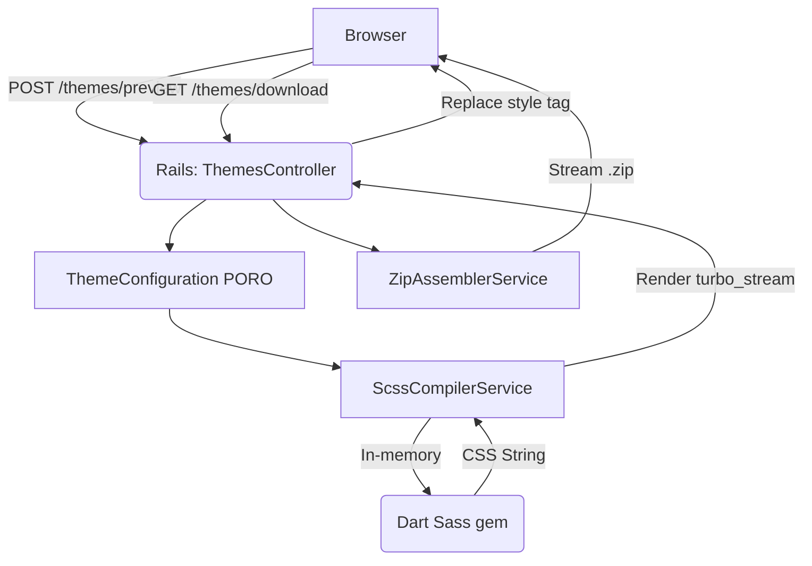

---
vc-id: 2508316c-9bcc-46ae-8e90-fcc4f10c3de1
---
# System Design (nanoCSS)

> **Project:** nanoCSS
> **Last Updated:** 2026-04-12 (Sprint 1)

---

## 1. High-Level Architecture

**Architectural style:** Modular Monolith (Ruby on Rails 7.2.3).
**Rationale:** The application is entirely stateless. Rails combined with Hotwire (Turbo Streams) provides the fastest path to a reactive UI without the overhead of a separate SPA frontend. Compilation is handled in-memory using Dart Sass.



---

## 2. Cross-Cutting Concerns

### 2.1 State Management (Stateless Architecture)
- **Approach:** Zero database. The source of truth for a user's configuration is the DOM form state.
- **Persistence:** Shareable URLs use `Base64.urlsafe_encode64` to pack the `ThemeConfiguration` attributes into the `?theme=` query parameter.
- **Dark Mode:** Stored locally in the browser's `localStorage` and applied via `data-theme` attribute.

### 2.2 Error Handling Strategy
- **Compiler Errors:** If a user inputs a combination that breaks Sass compilation (e.g., severe ratio disruption), `ScssCompilerService` rescues the error, returns a formatted string, and the UI displays a toast warning rather than crashing.
- **Input Validation:** Server-side regex validation for hex codes (`/\A#[0-9a-fA-F]{6}\z/`) and prefix names (`/\A[a-z][a-z0-9-]*[a-z0-9]\z/`).

### 2.3 Deployment & Environment
- **Hosting:** Self-hosted on an AlmaLinux 9 VPS (IONOS S Package).
- **Web Server:** Apache acting as a reverse proxy to Phusion Passenger.
- **Editor Ops:** System operations and file edits on the server to be handled using Vim. Development primarily driven via the Antigravity IDE.

### 2.4 Testing Strategy
- **Unit:** RSpec for POROs and Services (`ScssCompilerService`, `ZipAssemblerService`).
- **System:** Capybara + Selenium for end-to-end Hotwire interaction and JS-driven UI behaviour (e.g., modal dialogues).

---

## 3. Database Schema

**None.** This application is explicitly stateless to reduce operational overhead and liability. All configurations are handled in-memory and via URL parameters. No database engine is provisioned.

---

## 4. Internal API Contracts (Hotwire Routes)

### `POST /themes/preview`
**Request:** `FormData` submitted by Turbo Drive containing `ThemeConfiguration` attributes.
**Response (Turbo Stream):**
```html
<turbo-stream action="update" target="nanocss-preview-style">
  <template>
    <style>/* Compiled CSS String */</style>
  </template>
</turbo-stream>
```

### `POST /themes/download`
**Request:** `FormData` containing the final `ThemeConfiguration`.
**Response:** `Content-Type: application/zip`, `Content-Disposition: attachment; filename="nanocss.zip"`. Streams the assembled archive directly.

---

## Sprint 1 — The Core Engine

### Modules / Components Introduced

#### `ThemeConfiguration` (PORO)
- **Responsibility:** Validates inputs, maps form data to SCSS variables.
- **Interface:**
```ruby
class ThemeConfiguration
  include ActiveModel::Model
  attr_accessor :primary, :secondary, :tertiary, :prefix,
                :font_heading, :font_subtitle, :font_body, :font_code,
                :base_typography, :base_space, :base_margin,
                :base_radius, :base_border_width,
                :text_shadow, :drop_shadow, :tier, :mode

  def to_scss_variables_string
    # Outputs: $#{prefix}-primary: #{primary}; ...
  end
end
```

#### `ColourHarmonyService`
- **Responsibility:** Calculates Secondary and Tertiary colour suggestions using HSL rotation algorithms based on the user's selected Primary hex colour.
- **Interface:**
```ruby
class ColourHarmonyService
  def self.call(primary_hex, harmony_type: :complementary)
    # Returns [secondary_hex, tertiary_hex]
  end
end
```

#### `ScssCompilerService`
- **Responsibility:** Orchestrates compilation. **CRITICAL:** Do NOT generate the base SCSS partials (`_variables.scss`, `_mixins.scss`, `_utilities.scss`, etc.). These files are already authored and reside in `/app/assets/stylesheets/nanocss/`. The service must read these existing local files (read-only), prepend the user's dynamic variables generated by `ThemeConfiguration`, execute compilation, and handle the mathematical generation of the standard multiplier scale (`-xs` through `-xxl`).
- **Interface:**
```ruby
class ScssCompilerService
  def self.call(configuration, tier: :standard)
    # Returns { css: "...", error: nil }
  end
end
```
- **Dependencies:** `dart-sass` gem (`Sass.compile_string`).

#### `ZipAssemblerService`
- **Responsibility:** Generates the downloadable asset.
- **Dependencies:** `rubyzip` gem.
```ruby
class ZipAssemblerService
  def self.call(configuration, compiled_css)
    # Returns raw zip binary IO stream
  end
end
```

### Design Decisions (Sprint 1)
- **SCSS Compilation:** Dart Sass is run in-process via the `dart-sass` Ruby gem to prevent the overhead of spawning shell subprocesses for every preview keystroke. This bypasses the glibc compatibility issues found with `sass-embedded` on AlmaLinux 9.